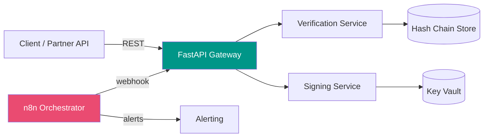

<div align="center">

# VeriStack

**Microservices architecture for cryptographic data validation and fiscal workflow automation.**

[](LICENSE)
[](https://www.python.org/)
[](https://fastapi.tiangolo.com/)
[](https://www.docker.com/)
[](https://n8n.io/)
[](https://github.com/franamaro-dev/VeriStack/actions)

</div>

---

## What it solves

Fiscal-grade data integrity is hard: invoices, ledgers and audit chains need to be **tamper-evident, signable and queryable** without coupling business logic to the cryptography layer.

VeriStack splits that concern into independent, dockerized microservices that talk over a private network and are orchestrated via **n8n** for retries, alerts and batch jobs.

---

## Architecture



| Service | Responsibility | Stack |
|---------|---------------|-------|
| **Gateway** | Auth, rate-limit, routing | FastAPI + JWT |
| **Verification** | Hash-chain validation, audit trail | Python + SQLite/PG |
| **Signing** | Cryptographic signing, key rotation | Python + `cryptography` |
| **Orchestration** | Retries, batch jobs, alerts | n8n |

---

## Quickstart

```bash
git clone https://github.com/franamaro-dev/VeriStack.git
cd VeriStack
docker compose up --build
```

Gateway will be available at `http://localhost:8000/docs` (OpenAPI).

### Run tests

```bash
pip install -r requirements.txt
pytest -v
```

See [TESTING.md](TESTING.md) for fixtures and coverage strategy.

---

## Tech stack

| Layer | Tools |
|-------|-------|
| API | FastAPI, Pydantic v2 |
| Crypto | `cryptography`, hashlib, JWT |
| Persistence | SQLite (dev), PostgreSQL (prod) |
| Orchestration | n8n |
| Packaging | Docker, docker-compose |
| Testing | pytest, httpx |

---

## Project structure

```
.
├── app/                  # FastAPI services (gateway, verify, sign)
├── tests/                # pytest suite
├── docker-compose.yml    # multi-service orchestration
├── Dockerfile            # base image
├── requirements.txt
└── TESTING.md            # test strategy
```

---

## Roadmap

- [ ] XAdES signature module (RD 1007/2023 compliance)
- [ ] Distributed hash chain (Merkle tree)
- [ ] OpenTelemetry instrumentation
- [ ] Helm chart for Kubernetes

---

## License

[MIT](LICENSE) © Francisco Amaro Prieto

---

<div align="center">

Built by [Francisco Amaro](https://github.com/franamaro-dev) — Backend Engineer & SOC L1 Analyst
[LinkedIn](https://linkedin.com/in/franamaro) · [Email](mailto:franamaroprieto@gmail.com)

</div>
